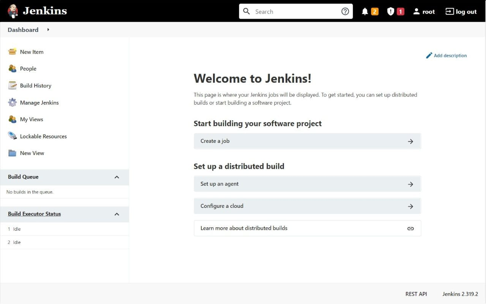

# Jenkins CI/CD pipeline

Deploy Jenkins server with CI/CD on Elestio

 
 

# Once deployed ...

You can can open Jenkins UI here:

    URL: https://[CI_CD_DOMAIN]
    Login: root
    password: [JENKINS_PASSWORD]

If you wish to get email notifications about builds status, you should configure SMTP settings through WEB UI, follow to the "Manage Jenkins/Configure System" menu Item. Find there "E-mail Notification" section and fill "SMTP server" field with 172.17.0.1, port 25 without TLS, and set the email FROM address to [DOMAIN]@vm.elestio.app. Alternatively you can setup any third party SMTP service.

